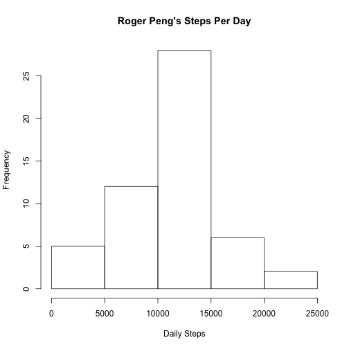
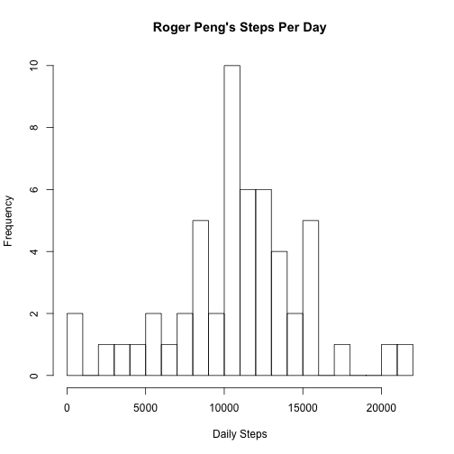
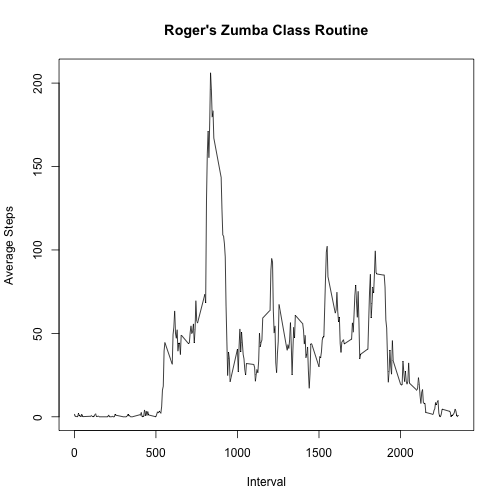
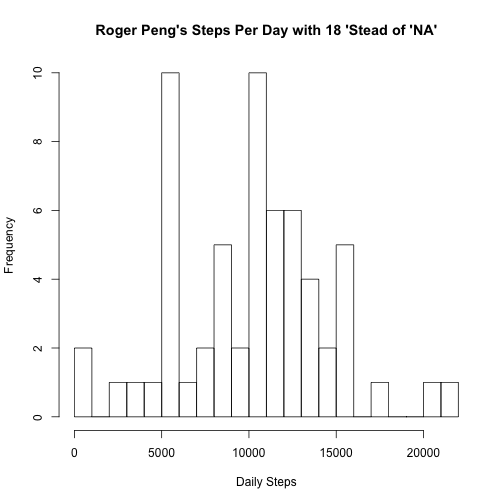
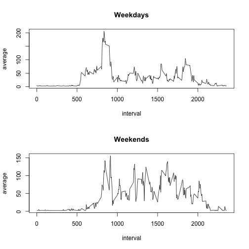

## Johns Hopkins/ Coursera. Reproducible Research. Assignment 1.
### By Steven Reddick, Super Data Scientist in Training.  
  
#### Motivation for the project:
This project uses FitBit data obtained from Roger Peng's FitBit that he wore for one week in 2012 while he and Jeff Leek experimented with a shake-weight and nutri-fast fitness routine.

##### The analysis attempts to address the following questions:  
1. What is mean total number of steps taken per day?
1. What is the average daily activity pattern?
1. Are there differences in activity patterns between weekdays and weekends?
1. Why did Roger Peng give up on fitness after just one week?  

##### Loading and Preprocessing the data:
To analyze data, you have to have it, so if you don't have it, you have to get it. "I Don't have the data, Steven, what do I do!?!," you say?  Well, calm your racing heart because I generously crafted the following code that will solve your trifling little data problem.


```r
if(!file.exists("repdata-data-activity.zip")) {
        system("mkdir ~/temp", wait=FALSE)
        setwd("~/temp")
        download.file("https://d396qusza40orc.cloudfront.net/repdata%2Fdata%2Factivity.zip")
        unzip(zipfile = "repdata-data-activity.zip")
} else if(!file.exists("activity.csv")){
        unzip(zipfile = "repdata-data-activity.zip")
}
fitBitRawData <- read.csv("activity.csv", header=TRUE)
```

After they run that snippet of code you just saw, people often tell me "Woah, this is crazy, there's a bunch of numbers - I'm so scared that I peed and it's leaking through my pants."  Again, I have to assert, "Shhh...," that it will all be ok once they run the processing code below.  
First we use the "Dplyr" package to turn the dataset into a tbl_df.  
Then we explore its current state:  


```r
library(dplyr)
fitBitRawData <- tbl_df(fitBitRawData)
str(fitBitRawData)
```

```
## Classes 'tbl_df', 'tbl' and 'data.frame':	17568 obs. of  3 variables:
##  $ steps   : int  NA NA NA NA NA NA NA NA NA NA ...
##  $ date    : Factor w/ 61 levels "2012-10-01","2012-10-02",..: 1 1 1 1 1 1 1 1 1 1 ...
##  $ interval: int  0 5 10 15 20 25 30 35 40 45 ...
```

Next, let's clean it up to convert the date from factor into something useful, like POSIXct.  For this, I like using the "Lubridate" package.


```r
library(lubridate)
fitBitRawData <- mutate(fitBitRawData, date = ymd(date))
```
#### Means Number of Steps Per Day  
OK, now that we have some data, lets start picking it apart.  Oh, you want a histogram and a barplot?  Well, daddy is here to provide for you, little baby birds.  
First, we're gonna need to use dplyr to group and summarize by day, then I can feed you your plots.


Wow, that plot looks like a giant middle finger.  I guess that's how Roger Peng subliminally likes to establish his dominance over us.  
Let's save some face by making more bins and getting something more meaningful out of this nonsense.  

Now it looks like the Baltimore skyline.  Look carefully, you can just make out Johns Hopkins University where someone's car getting broken into.  Ah, Baltimore, you're so mean.  
Speaking of mean, that brings us to the next question.  What was the mean and median of Roger Peng's daily steps during his fitness phase?  Lets use the power of my MacBook Air to compell R to tell us.  
#### Average Daily Activity Patterns.  

One problem, there's a bunch of "NA's" clogging up the pipes.  This dataset be lookin' like the BatMan themesong with all them NA's.  
Like BatMan, I'll swoop in and be your hero by knocking them out. POW!

```r
WHAT_IS_THE_MEAN_I_DEMAND_YOU_TELL_ME <- mean(na.omit(stepsPerDay$steps_Each_Day))
WHAT_IS_THE_MEDIAN_I_DEMAND_YOU_TELL_ME <- median(na.omit(stepsPerDay$steps_Each_Day))

WHAT_IS_THE_MEAN_I_DEMAND_YOU_TELL_ME
```

```
## [1] 10766.19
```

```r
WHAT_IS_THE_MEDIAN_I_DEMAND_YOU_TELL_ME
```

```
## [1] 10765
```
According to Temple University (www.temple.edu/hr/departments/benefits/documents/Conversion_Chart.pdf), there are roughly 2000 steps in a mile. So, Peng was steppin', like, 5 miles a day.  That's a lot of Zumba, bro.  
"Oh neat, which days does Roger do Zumba, I do Tuesday and Thursday," you tell me.  That's nice- I wouldn't know because I'm busy reading Southern Living on the eliptical machine next to the old Asian ladies.  
But, since you want to make sure to get your spot before Peng shows up and takes the last set of pink 2 lb weights, let's see what class time he shows up to.  
By the way, he brings his own yoga mat.  It's a purple knock off LuLuLemon he got off eBay.  

To do this, I'll make you a dataset that takes the average steps during each interval and plot it as a time series.  Again, we're going to omit NA's because they're soooo 1992.  
After that, we'll find out which interval had the highest steps, on average, which is probably when Roger goes to his Zumba class. 

```r
interval_steps_average <- group_by(na.omit(fitBitRawData), interval) %>%
                                summarize(average_steps_taken = mean(na.omit(steps)))

plot(interval_steps_average$interval ,interval_steps_average$average_steps_taken, main="Roger's Zumba Class Routine", xlab="Interval", ylab="Average Steps", type="l")
```



```r
WHEN_DOES_ROGER_GO_TO_ZUMBA <- interval_steps_average[max(interval_steps_average$average_steps_taken),1]

WHEN_DOES_ROGER_GO_TO_ZUMBA
```

```
## Source: local data frame [1 x 1]
## 
##   interval
##      (int)
## 1     1705
```
Since there are 2355 intervals in each day, it's unlikely that the device collects in 5 minute increments, as claimed by the assignment instructions.  
It's probably more like .61 minute increments (i.e. (60*24)/2355).  
So, that means that the 1705th interval is 1040.05 minutes elapsed since midnight, which is 1040.05/60 => 17.33 hours, i.e. 5:30PM.  
So, looks like ol' Roger likes to hit the Zumba class after he gets off work.


#### Calcualting and Imputing NA's.  
"But, Steven, what about all the NA's?" Ok, so, this isn't good enough for you? Fine. Let's get jiggy with it.  NA NA NA NA NA NA NA, gettin' jiggy with it. 


```r
number_of_NAs <- length(which(is.na(fitBitRawData)))

number_of_NAs
```

```
## [1] 2304
```
And there you have it.  2304 of the 17568 rows (13%) are NA's. "That's pretty bad right, Steven?" To that I say, "Na."  

"Well, can you devise a non-complex strategy to fill in the missing values?" Yes, I can. I can come up with some really intense stuff, like filling them all in with numbers from license plates on cars in my apartment complex lot.  Or, what about if i filled them all in with sqrt(2)?!  "That's irrational, Steven!" Yes, yes it is... But, for the sake of my time, what I'll do is fill in the missing values with the number 18 because that's Peyton Manning's jersey number and he had posession of the ball as I typed this. There you go, pretty unsophisticated.  

```r
fitBitRawData[is.na(fitBitRawData)] <- 18

stepsPerDayNoNA <- group_by(fitBitRawData, date) %>%
                        summarize(steps_Each_Day = sum(steps))

hist(stepsPerDayNoNA$steps_Each_Day, main="Roger Peng's Steps Per Day with 18 'Stead of 'NA'", xlab="Daily Steps", ylab="Frequency", breaks = 20)
```


Wow, another Baltimore skyline. Now you can see MLK and Pratt where there's a homeless guy asking you for money to "get a bus to Philadelphia to get to an important court date."  
And, as is customary in ancient Nepalese cuisine, here is the mean and median, now give me 3 goats for my daughter.  

```r
WHATS_THE_MEAN_DAWG <- mean(stepsPerDayNoNA$steps_Each_Day)
WHATS_THE_MEDIAN_DAWG <- median(stepsPerDayNoNA$steps_Each_Day)

WHATS_THE_MEAN_DAWG
```

```
## [1] 10034.1
```

```r
WHATS_THE_MEDIAN_DAWG
```

```
## [1] 10395
```
Oh, it's just enthralling!  
New values of 10034 mean and 10395 median compared to the old values of 10076 and 10765.  
Guess that means Peyton Manning Zumbas harder than Roger Peng.  

#### Weekdays and Weekends
Here's a real treat for you - I'm going to add a factor variable to show how Peng's steps change on weekends when he does water aerobics.  


```r
fitBitRawData <- mutate(fitBitRawData, weekDay=as.factor(weekdays(date)))
fitBitRawData$dayFactor <- 0
fitBitRawData$dayFactor<-apply(fitBitRawData[,4],1,function(x){ ifelse(x=="Sunday"|x=="Saturday",0,1)
})

fitBitRawDataWeekdays <- fitBitRawData[fitBitRawData$dayFactor==1,]
fitBitRawDataWeekends <- fitBitRawData[fitBitRawData$dayFactor==0,]
```
Messy? Yes. Accurate? Yesser.  
"I want to see the averages by increment, nyaaaaaah."  Good lord, does this assignment ever end? OK. Give me full credit, then.  

```r
weekends <- group_by(fitBitRawDataWeekends, interval) %>%
                        summarise(average = mean(steps))
weekdays <- group_by(fitBitRawDataWeekdays, interval) %>%
                        summarise(average = mean(steps))

par(mfrow=c(2,1))
plot(weekdays, main="Weekdays", type="l")
plot(weekends, main="Weekends", type="l")
```


Wow, that was so cool I fell asleep.  
Well, I hope you enjoyed this enthralling presentation!

